# Stopify
App in PHP connected with Spotify API to manage songs and playlists

## Login and Register Page with Animations

## Register Form
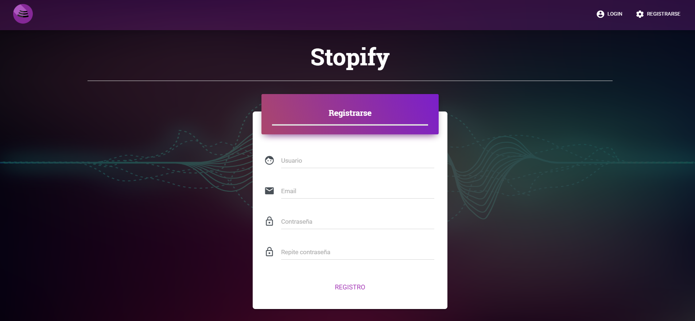

## Validating register form with HTML & Javascript
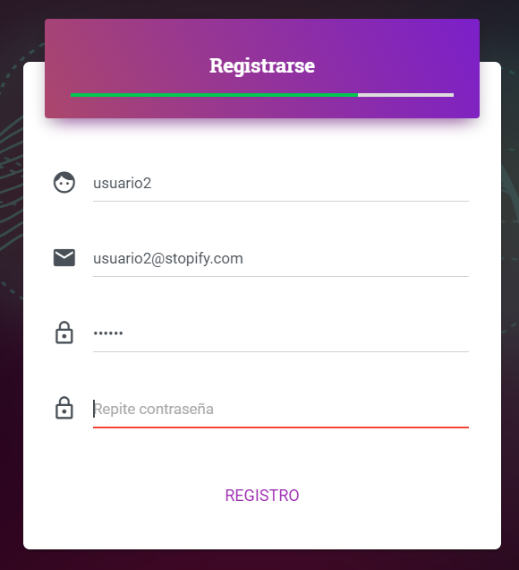

## Error MSG
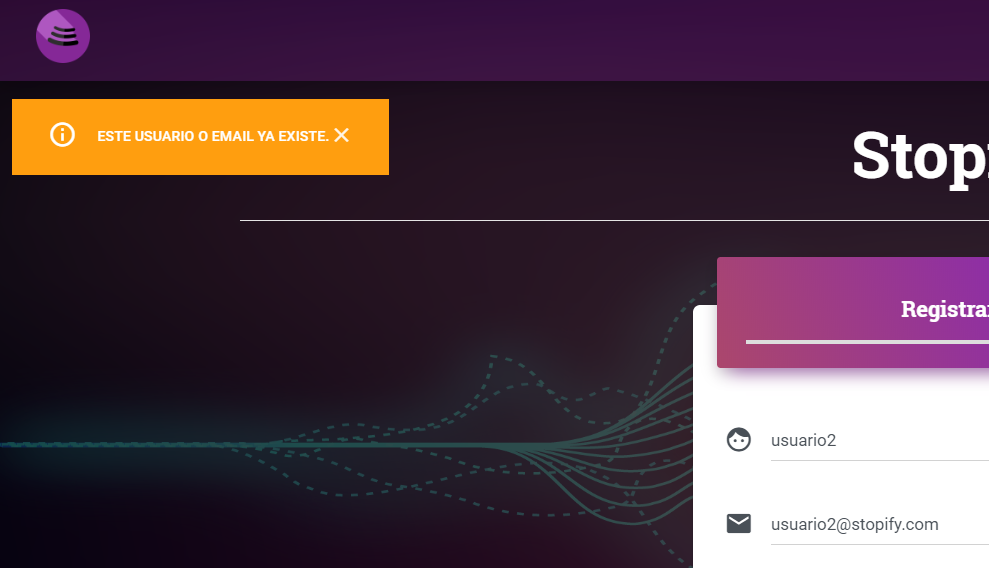

## Profile Page
Here you can see your favorite songs saved or your playlists and manage them. Also you canchangeyour username.
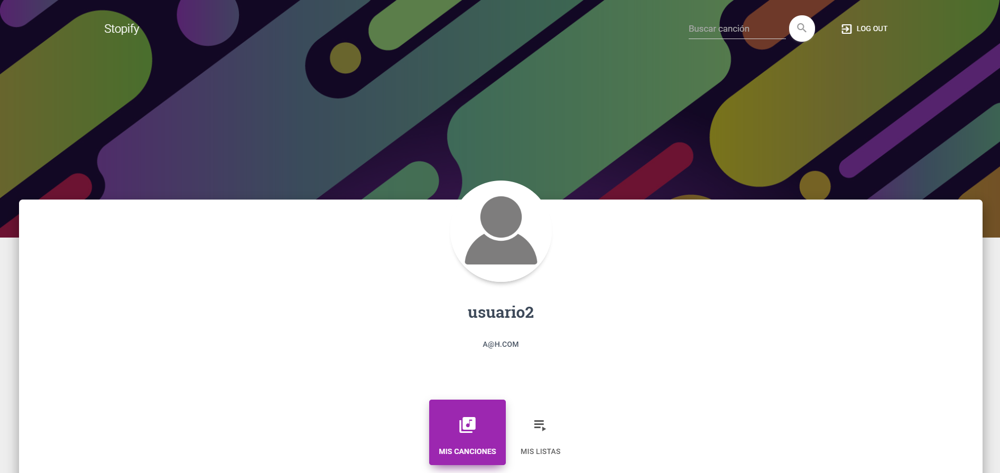
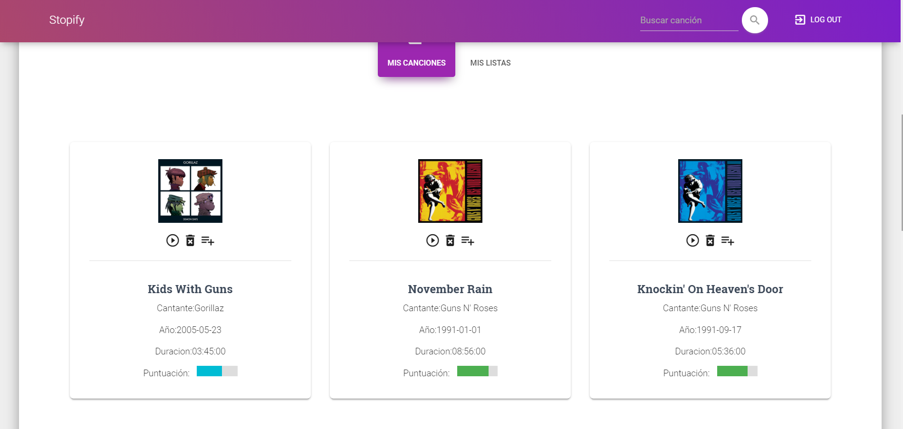
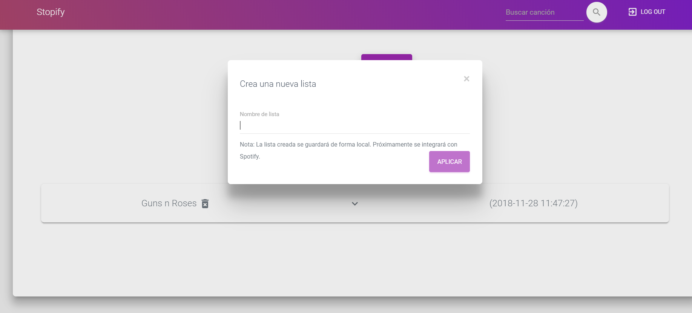
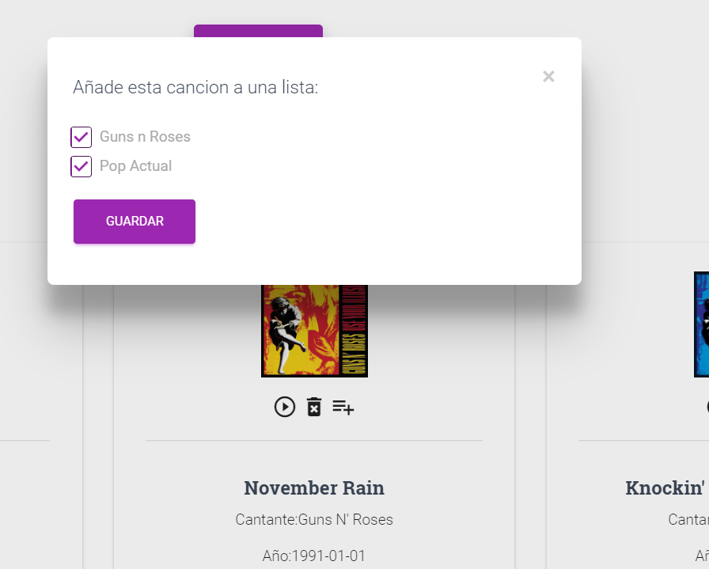
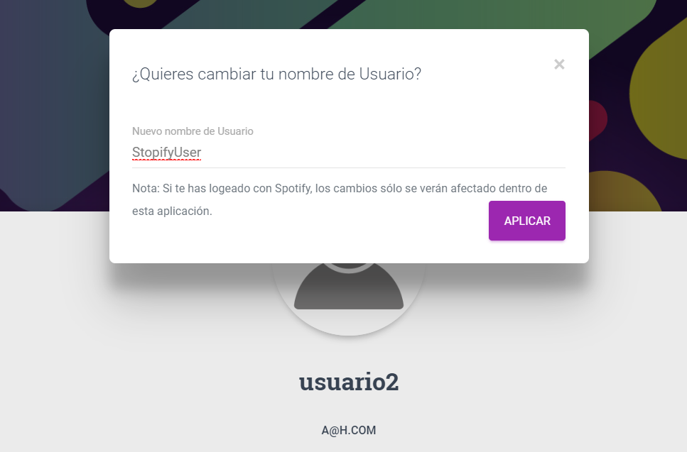

## Searching for a song
Dinamic datalist from local BBDD for suggestions in the form.
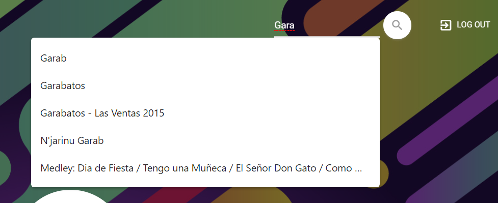

## Search Page
Here you can save a song as a favourite or listen a preview of 30s.
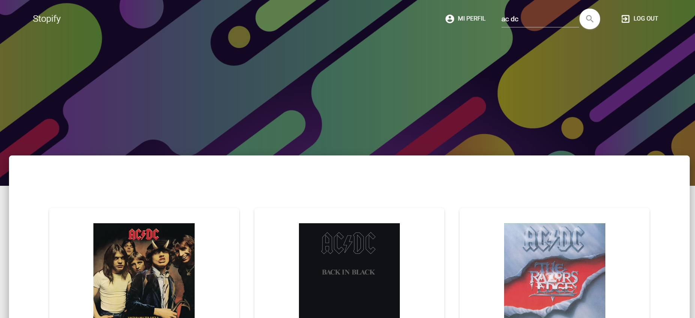
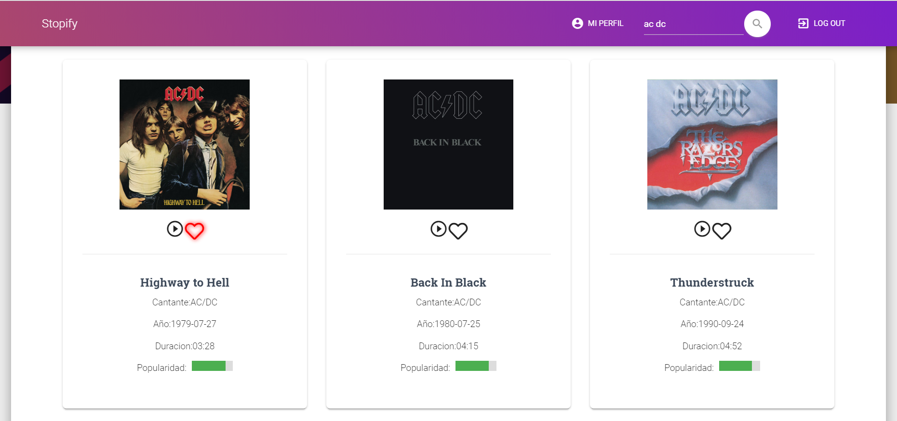

## Admin Page
Control the statistics of the application.
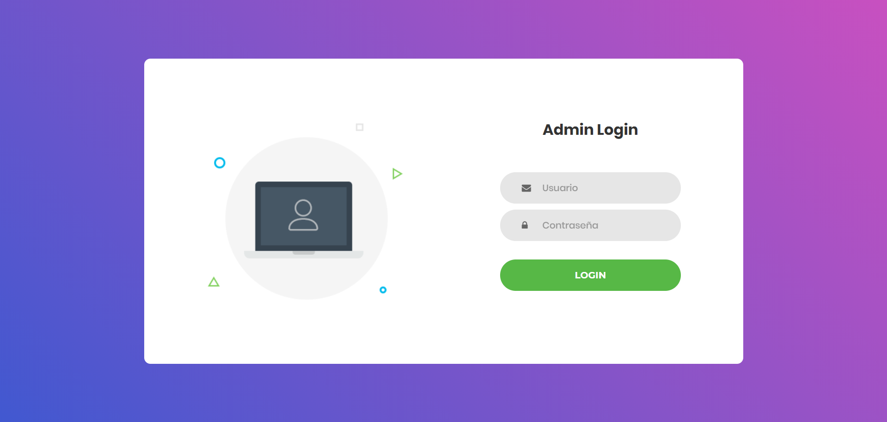
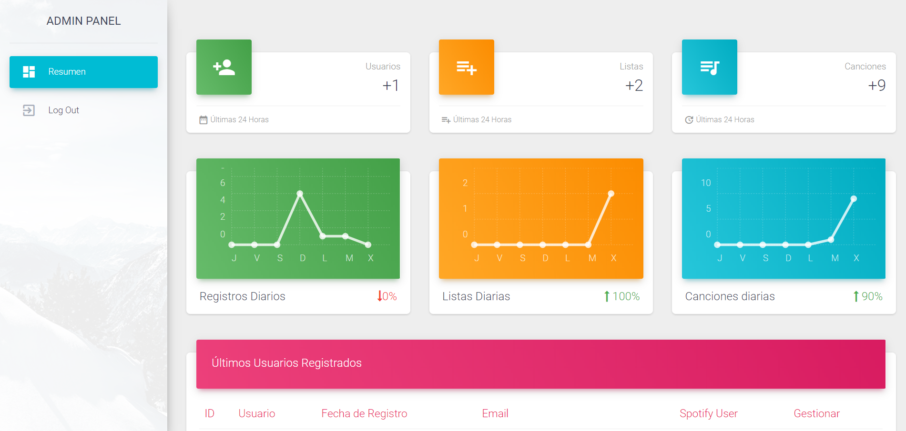
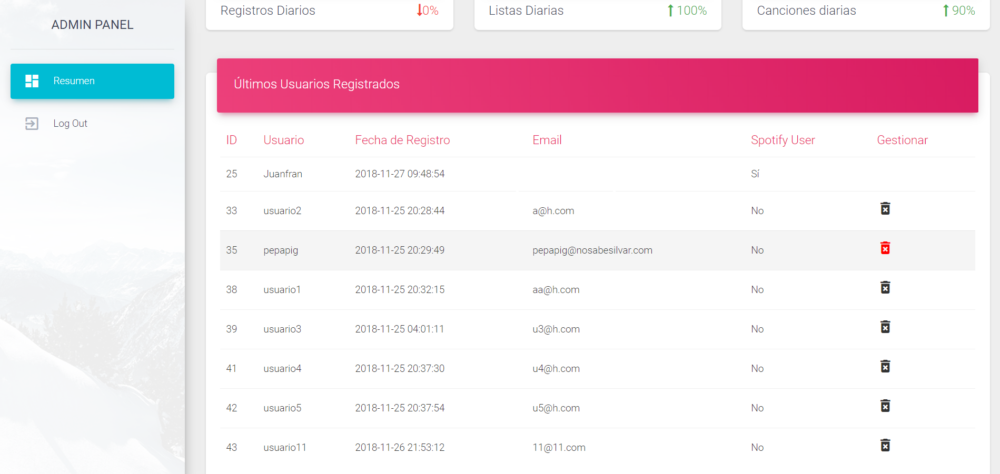

## Forbidden 403 Page
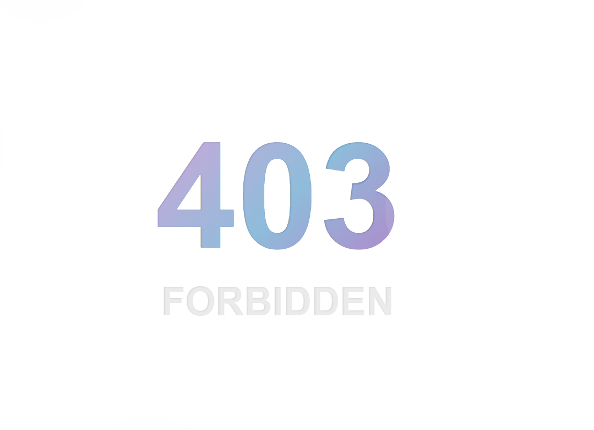
